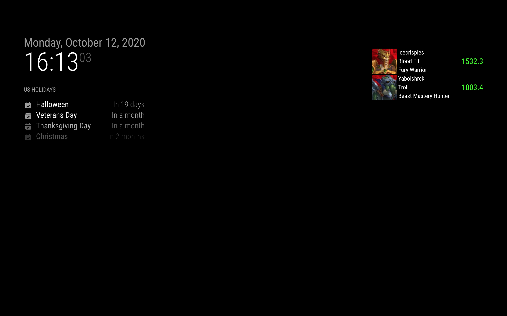
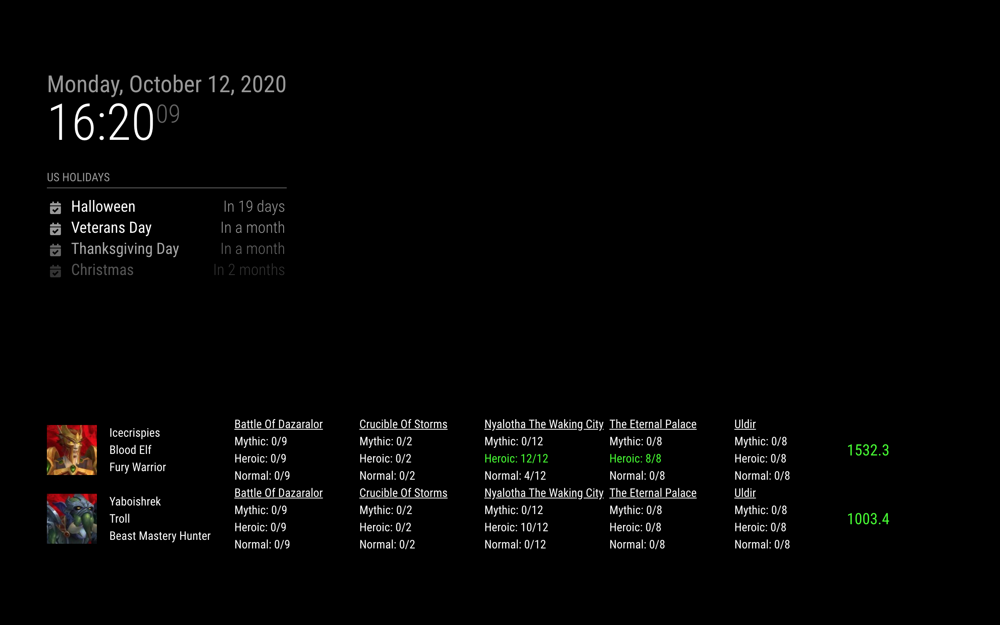

# MMM-RaiderIO
Magic Mirror - Raider IO module

## Install

`cd` into `modules` then run `git clone` https://github.com/jwcnewton/MMM-RaiderIO.git 

## Example Config

Compact mode

```json
{
    module: "MMM-RaiderIO",
    position: "top_right",
    header: "Raider IO",
    config: {
        compact: true,
        characters: [{
            region: "eu",
            realm: "stormscale",
            name: "icecrispies"
        },
        {
            region: "eu",
            realm: "stormscale",
            name: "yaboishrek"
        }]
    }
}
```



```json
{
    module: "MMM-RaiderIO",
    position: "bottom_bar",
    header: "Raider IO",
    config: {
        compact: false,
        characters: [{
            region: "eu",
            realm: "stormscale",
            name: "icecrispies"
        },
        {
            region: "eu",
            realm: "stormscale",
            name: "yaboishrek"
        }]
    }
}
```

